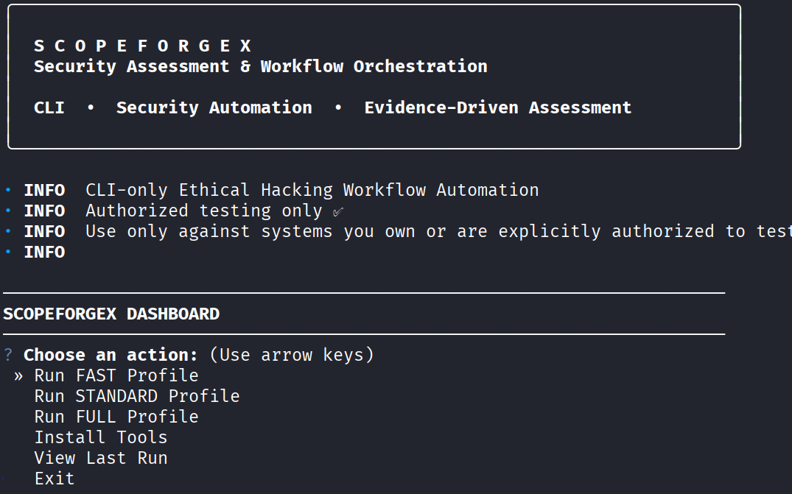
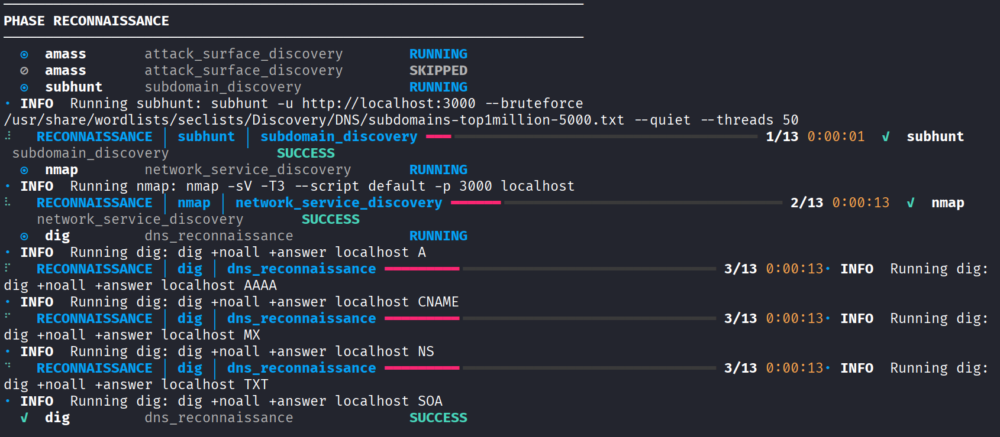
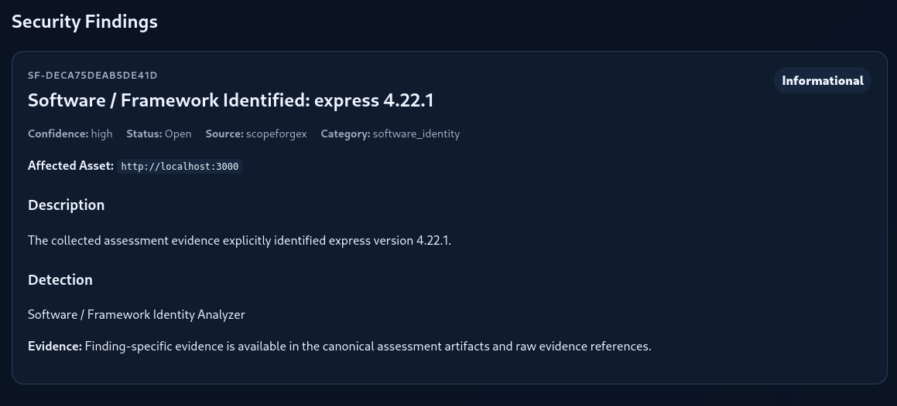
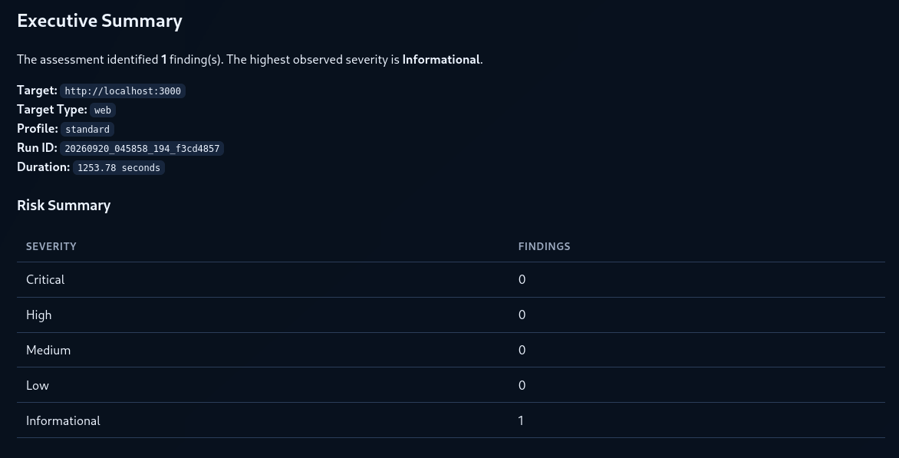
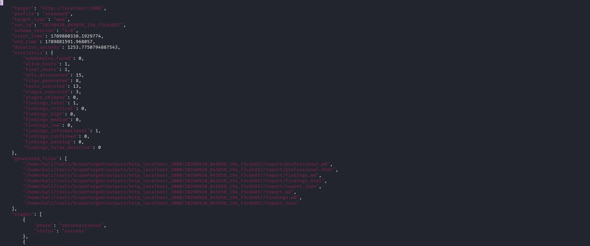

<div align="center">

# ScopeForgeX


A stage-based **cybersecurity workflow orchestration framework** for authorized security assessments, combining security-tool execution, structured evidence collection, finding normalization, correlation, vulnerability intelligence, and professional reporting.

</div>

---

## ✨ Highlights

- 🧭 **Stage-based assessment workflow**
- 🛠️ **19 security tools** integrated through canonical tool adapters
- 🎛️ **FAST, STANDARD, and FULL execution profiles**
- 🎯 **Target-aware tool selection and conditional execution**
- 🧾 **Structured execution results and evidence collection**
- 🔎 **Finding normalization, correlation, and deduplication**
- 🧠 **CVE, NVD, and KEV vulnerability intelligence**
- 🛡️ **Evidence sanitization before publication**
- 📊 **Professional HTML, Markdown, and JSON reporting**
- 🔗 **Subhunt integration for focused reconnaissance**
- 🕷️ **Wapiti-based web vulnerability assessment**
- ⏱️ **Configurable tool and workflow timeouts**
- 🧪 **Automated regression and integration testing**
- 📈 **Benchmark evidence for orchestration overhead**

---

## 📸 Demo

### Dashboard



*Interactive ScopeForgeX dashboard showing the assessment banner, authorization notice, and execution-profile selection.*

### Reconnaissance



*Reconnaissance-stage execution against an authorized local OWASP Juice Shop target.*

### Vulnerability Assessment



*Normalized vulnerability-assessment output and finding presentation.*

### Professional Report



*Professional assessment report showing the assessment summary and severity overview.*

### Machine-Readable Report



*Canonical JSON assessment output containing execution metadata, statistics, stages, findings, and generated artifacts.*

---

## Contents

- [✨ Highlights](#-highlights)
- [📸 Demo](#-demo)
- [✨ Why ScopeForgeX?](#-why-scopeforgex)
- [⚙️ Core Capabilities](#️-core-capabilities)
- [🏗️ Architecture](#️-architecture)
- [🔄 Assessment Workflow](#-assessment-workflow)
- [🎛️ Execution Profiles](#️-execution-profiles)
- [🧰 Supported Tools](#-supported-tools)
- [🎯 Target-Aware Execution](#-target-aware-execution)
- [🔗 Subhunt Integration](#-subhunt-integration)
- [🕷️ Wapiti Vulnerability Assessment](#️-wapiti-vulnerability-assessment)
- [🧠 Vulnerability Intelligence](#-vulnerability-intelligence)
- [📊 Reporting](#-reporting)
- [🔒 Evidence Safety](#-evidence-safety)
- [🚀 Quick Start](#-quick-start)
- [📦 Installation](#-installation)
- [💻 Usage](#-usage)
- [🧪 Local Juice Shop Example](#-local-juice-shop-example)
- [📈 Benchmark](#-benchmark)
- [⏱️ Runtime and Timeouts](#️-runtime-and-timeouts)
- [🧪 Testing](#-testing)
- [📁 Repository Structure](#-repository-structure)
- [🧠 Design Philosophy](#-design-philosophy)
- [⚠️ Current Limitations](#️-current-limitations)
- [🛣️ Roadmap](#-roadmap)
- [⚖️ Legal & Ethical Use](#️-legal--ethical-use)
- [📄 License](#-license)

---

## ✨ Why ScopeForgeX?

Security tools are powerful individually, but a real assessment requires more than launching commands.

ScopeForgeX provides an orchestration layer around security tooling so that an assessment can move through a consistent pipeline:

```text
Target
  │
  ▼
Scope & Authorization
  │
  ▼
Reconnaissance
  │
  ▼
Enumeration
  │
  ▼
Vulnerability Assessment
  │
  ▼
Validation / Exploitation
  │
  ▼
Credential Assessment
  │
  ▼
Finding Normalization
  │
  ▼
Correlation & Deduplication
  │
  ▼
Vulnerability Intelligence
  │
  ▼
Reporting & Cleanup
```

The project is designed to make tool execution **structured, observable, reproducible, and evidence-driven** rather than treating individual command-line tools as isolated scripts.

---

## ⚙️ Core Capabilities

| Capability | Description |
|---|---|
| Workflow orchestration | Coordinates security tools across assessment stages |
| Tool adapters | Provides a canonical interface for individual security tools |
| Execution results | Captures exit status, stdout, stderr, timing, metadata, and execution state |
| Target-aware execution | Selects or skips tools based on the target type and stage |
| Evidence collection | Converts raw tool output into structured observations |
| Finding normalization | Converts observations into canonical findings |
| Correlation | Associates related evidence and findings |
| Deduplication | Prevents duplicate findings from multiple sources |
| Vulnerability intelligence | Enriches applicable software findings with vulnerability data |
| Evidence sanitization | Prevents raw HTTP payloads from leaking into published reports |
| Reporting | Generates Markdown, HTML, and JSON assessment outputs |
| Profiles | Supports FAST, STANDARD, and FULL assessment profiles |
| Timeouts | Supports profile and tool-specific execution timeouts |
| Testing | Includes unit, regression, integration, and contract coverage |

---

# 🏗️ Architecture

ScopeForgeX follows a layered pipeline in which tools produce execution results, collectors transform those results into structured observations, and the finding pipeline produces canonical security findings.

```text
┌───────────────────────────────────────────────┐
│                 ScopeForgeX CLI               │
└───────────────────────┬───────────────────────┘
                        │
                        ▼
┌───────────────────────────────────────────────┐
│              Workflow Engine                  │
│     Profile + Stage + Target Selection        │
└───────────────────────┬───────────────────────┘
                        │
                        ▼
┌───────────────────────────────────────────────┐
│                Tool Registry                  │
│             ToolAdapter / ToolBase            │
└───────────────────────┬───────────────────────┘
                        │
                        ▼
┌───────────────────────────────────────────────┐
│                Tool Executor                  │
│       Command construction + execution        │
└───────────────────────┬───────────────────────┘
                        │
                        ▼
┌───────────────────────────────────────────────┐
│               ExecutionResult                 │
│       stdout / stderr / status / timing       │
└───────────────────────┬───────────────────────┘
                        │
                        ▼
┌───────────────────────────────────────────────┐
│                  Collectors                   │
│       Tool output → structured observations   │
└───────────────────────┬───────────────────────┘
                        │
                        ▼
┌───────────────────────────────────────────────┐
│              Finding Normalizer               │
└───────────────────────┬───────────────────────┘
                        │
                        ▼
┌───────────────────────────────────────────────┐
│          Correlation / Deduplication          │
└───────────────────────┬───────────────────────┘
                        │
                        ▼
┌───────────────────────────────────────────────┐
│          Vulnerability Intelligence           │
│              NVD + KEV enrichment             │
└───────────────────────┬───────────────────────┘
                        │
                        ▼
┌───────────────────────────────────────────────┐
│                Reporting Layer                │
│        HTML / Markdown / JSON / cleanup       │
└───────────────────────────────────────────────┘
```

---

## Execution Contract

The canonical tool flow is:

```text
Tool Adapter
     │
     ▼
ExecutionResult
     │
     ▼
Raw Evidence
     │
     ▼
Collector
     │
     ▼
Structured Observations
     │
     ▼
Finding Normalizer
     │
     ▼
Finding
     │
     ▼
Correlation / Deduplication
     │
     ▼
Report
```

The architecture deliberately separates:

- command execution
- raw execution evidence
- evidence interpretation
- finding creation
- finding correlation
- vulnerability enrichment
- publication

---

# 🔄 Assessment Workflow

ScopeForgeX organizes assessment activity into seven logical stages.

| Stage | Purpose |
|---|---|
| **0 — Scope & Authorization** | Validate target scope and authorization requirements |
| **1 — Reconnaissance** | Discover domains, hosts, services, and web targets |
| **2 — Enumeration** | Enumerate services, URLs, technologies, routes, and application surfaces |
| **3 — Vulnerability Assessment** | Identify potential vulnerabilities and security weaknesses |
| **4 — Validation / Exploitation** | Validate selected vulnerabilities where the configured workflow permits |
| **5 — Credential Assessment** | Perform credential-related assessment using configured tools |
| **6 — Reporting & Cleanup** | Normalize, correlate, sanitize, publish, and finalize assessment artifacts |

The active orchestration layer is centered around:

```text
scopeforgex/workflow.py
scopeforgex/registry/
scopeforgex/tools/
scopeforgex/collectors/
scopeforgex/findings/
scopeforgex/intelligence/
reporting/
```

---

# 🎛️ Execution Profiles

ScopeForgeX currently provides three execution profiles.

| Profile | Configured Tools | Intended Use |
|---|---:|---|
| **FAST** | 3 | Rapid assessment and quick feedback |
| **STANDARD** | 13 | General-purpose security assessment |
| **FULL** | 17 | Broader assessment coverage |

Profiles are defined in:

```text
scopeforgex/config/profiles.yaml
```

Example:

```bash
python3 -m scopeforgex \
  --profile standard \
  --target https://example.com \
  --authorized
```

---

# 🧰 Supported Tools

The current integrated tool set contains 19 security utilities.

## Reconnaissance

| Tool | Purpose |
|---|---|
| **Amass** | Domain and attack-surface reconnaissance |
| **Subhunt** | DNS subdomain and HTTP virtual-host enumeration |
| **Nmap** | Host and service discovery |
| **dig** | DNS interrogation |

## Web Enumeration

| Tool | Purpose |
|---|---|
| **Katana** | Web crawling and endpoint discovery |
| **httpx** | HTTP probing and service identification |
| **ffuf** | Content and endpoint discovery |
| **WhatWeb** | Web technology identification |
| **Kiterunner** | API route and endpoint discovery |
| **jsluice** | JavaScript analysis and endpoint extraction |

## Vulnerability Assessment

| Tool | Purpose |
|---|---|
| **Wapiti** | Web application vulnerability assessment |
| **Nikto** | Web server security checks |
| **testssl.sh** | TLS/SSL configuration assessment |

## Validation / Exploitation

| Tool | Purpose |
|---|---|
| **sqlmap** | SQL injection assessment and validation |
| **Dalfox** | XSS assessment |
| **SSTImap** | Server-side template injection assessment |

## Credential Assessment

| Tool | Purpose |
|---|---|
| **Hydra** | Network authentication assessment |
| **Hashcat** | Password hash assessment |
| **JWT Tool** | JSON Web Token analysis |

---

# 🎯 Target-Aware Execution

Not every security tool is appropriate for every target.

ScopeForgeX therefore applies target-aware conditions before execution.

Examples include:

- domain reconnaissance tools require an applicable domain target
- IP literals are not treated as domain reconnaissance targets
- HTTPS-only tooling can be skipped for plain HTTP targets
- URL-oriented tools receive URL targets
- hostname-oriented tools receive normalized hostnames
- tools that do not apply to a target are represented as **SKIPPED**
- execution failures remain **FAILED** rather than being silently converted to success

```text
SUCCESS  → tool executed successfully
SKIPPED  → tool was intentionally not applicable
FAILED   → tool was selected but execution failed
```

---

# 🔗 Subhunt Integration

ScopeForgeX integrates **Subhunt** as a focused reconnaissance component.

Subhunt supports:

- DNS subdomain enumeration
- HTTP virtual-host enumeration
- DNS-over-HTTPS resolution
- resolver failover
- wildcard-aware DNS handling
- HTTP baseline fingerprinting
- catch-all filtering
- evidence-rich HTTP results
- quiet output
- JSON output
- deterministic result processing

ScopeForgeX integration:

```text
scopeforgex/tools/stage1_recon_web.py
scopeforgex/collectors/subhunt.py
```

Example standalone HTTP usage:

```bash
subhunt \
  -u http://localhost:3000 \
  --bruteforce /usr/share/wordlists/seclists/Discovery/DNS/subdomains-top1million-5000.txt \
  --threads 50
```

---

# 🕷️ Wapiti Vulnerability Assessment

Wapiti is the current web vulnerability assessment engine integrated into the Stage 3 vulnerability workflow.

Adapter:

```text
scopeforgex/tools/stage3_vuln.py
```

Collector:

```text
scopeforgex/collectors/wapiti.py
```

Wapiti output is converted into ScopeForgeX observations and then passed through the normal finding pipeline.

---

# 🧠 Vulnerability Intelligence

The intelligence subsystem contains:

```text
scopeforgex/intelligence/
├── engine.py
├── models.py
├── nvd.py
└── kev.py
```

The pipeline can associate identified software with:

- CPE information
- CVEs
- NVD vulnerability information
- Known Exploited Vulnerabilities (KEV) information

Software assessments are retained across vulnerability-intelligence analysis calls and deduplicated using their assessment identity.

CVE summaries include findings with CVE identifiers regardless of finding severity.

---

# 📊 Reporting

ScopeForgeX produces multiple report representations from the same assessment state.

Typical generated artifacts include:

```text
professional.md
professional.html
findings.md
findings.html
report.json
```

The JSON report provides machine-readable assessment data including:

- target
- profile
- run identifier
- execution duration
- host statistics
- URL statistics
- tool execution results
- stage status
- findings
- severity counts
- CVE information
- KEV information
- generated artifacts
- evidence references

Reporting code:

```text
reporting/
├── findings.py
├── json_exporter.py
├── models.py
├── report_generator.py
└── severity.py
```

---

# 🔒 Evidence Safety

ScopeForgeX distinguishes between:

```text
Raw execution evidence
        ↓
Internal analysis evidence
        ↓
Structured observations
        ↓
Canonical findings
        ↓
Published report evidence
```

Raw HTTP payloads are prevented from propagating into published vulnerability intelligence and reports.

Publication-facing evidence removes fields such as:

```text
body
raw_body
raw_header
raw_headers
request
raw_request
response
raw_response
```

Raw execution stdout/stderr remains available internally for debugging and execution analysis.

---

# 🚀 Quick Start

## Clone

```bash
git clone https://github.com/VikashChoudhary-04/ScopeForgeX.git
cd ScopeForgeX
```

## Virtual environment

```bash
python3 -m venv .venv
source .venv/bin/activate
```

## Python dependencies

```bash
pip install -r requirements.txt
```

## Verify CLI

```bash
python3 -m scopeforgex --help
```

## Authorized assessment

```bash
python3 -m scopeforgex \
  --profile standard \
  --target https://example.com \
  --authorized
```

---

# 📦 Installation

The ScopeForgeX installer covers the canonical external security-tool dependencies.

Current integrated toolchain:

```text
amass
subhunt
nmap
dig
httpx
katana
ffuf
whatweb
kiterunner
jsluice
wapiti
nikto
testssl.sh
sqlmap
dalfox
jwt_tool
sstimap
hydra
hashcat
```

Supporting packages include:

```text
python3
python3-pip
python3-venv
golang
git
build-essential
cargo
seclists
```

---

# 💻 Usage

## Interactive dashboard

```bash
python3 -m scopeforgex
```

Available actions include:

```text
Run FAST Profile
Run STANDARD Profile
Run FULL Profile
Install Tools
View Last Run
Exit
```

## FAST

```bash
python3 -m scopeforgex \
  --profile fast \
  --target https://example.com \
  --authorized
```

## STANDARD

```bash
python3 -m scopeforgex \
  --profile standard \
  --target https://example.com \
  --authorized
```

## FULL

```bash
python3 -m scopeforgex \
  --profile full \
  --target https://example.com \
  --authorized
```

---

# 🧪 Local Juice Shop Example

Start OWASP Juice Shop:

```bash
sudo docker run -d \
  --name juice-shop \
  -p 3000:3000 \
  bkimminich/juice-shop
```

If the container already exists:

```bash
sudo docker start juice-shop
```

Verify:

```bash
curl -I http://localhost:3000/
```

Run:

```bash
python3 -m scopeforgex \
  --profile standard \
  --target http://localhost:3000 \
  --authorized
```

A documented STANDARD reference run recorded:

| Metric | Result |
|---|---:|
| Target | `http://localhost:3000` |
| Profile | STANDARD |
| Selected tools | 13 |
| Successful tools | 11 |
| Failed tools | 1 |
| Skipped tools | 2 |
| Findings | 1 |
| Informational findings | 1 |
| CVEs | 0 |
| KEV findings | 0 |
| URLs discovered | 15 |
| Alive hosts | 1 |
| Final hosts | 1 |
| Duration | 1253.78 seconds |

The documented run identified Express `4.22.1` as software inventory information and produced an informational software-identity finding.

Kiterunner reached the configured **600-second tool timeout** during this reference run. ScopeForgeX preserved that execution state as a tool failure.

---

# 📈 Benchmark

Benchmark material is retained under:

```text
benchmark/
benchmark_scopeforgex/
```

A STANDARD-profile benchmark was performed against:

```text
https://warrantyindia.com/
```

ScopeForgeX reference execution:

```text
Duration: 1060.6487560272217 seconds
Logical tools: 13
Dig queries: 7
```

Four valid independent baseline runs recorded:

```text
1060.7696018240003 s
984.8302501480002 s
1060.8447160859996 s
994.6224477469987 s
```

Mean valid baseline:

```text
1025.2667539512497 s
```

Measured absolute difference:

```text
35.38200207597197 s
```

Measured relative overhead:

```text
3.4510045253700232 %
```

Approximately:

```text
3.45 %
```

One baseline attempt was excluded because the Nikto process terminated with a SIGPIPE-related return code.

See:

```text
benchmark/README.md
benchmark_scopeforgex/README.md
```

for methodology and captured evidence.

---

# ⏱️ Runtime and Timeouts

Timeout configuration flows through:

```text
profiles.yaml
      ↓
WorkflowEngine
      ↓
ToolExecutor
      ↓
ToolContext["tool_timeout"]
      ↓
Tool Adapter
      ↓
run_command()
```

The profile timeout provides the default.

An explicit tool-level timeout can override the profile/default value.

Timeouts are represented explicitly in execution results and reporting.

---

# 🧪 Testing

Run the full suite:

```bash
pytest -q
```

Compile the project:

```bash
python3 -m compileall scopeforgex reporting tests
```

Run selected integration tests:

```bash
pytest -q \
  tests/test_subhunt.py \
  tests/test_wapiti.py \
  tests/test_kiterunner_tool.py \
  tests/test_executable_resolution.py
```

Previously validated regression baseline:

```text
267 passed
```

Regenerate the test result after future source changes rather than treating the historical count as a permanent guarantee.

---

# 📁 Repository Structure

```text
ScopeForgeX/
├── benchmark/
│   ├── README.md
│   └── baseline_*/
│
├── benchmark_scopeforgex/
│   ├── README.md
│   └── baseline/
│
├── docs/
│   └── screenshots/
│       ├── dashboard.png
│       ├── recon-stage.png
│       ├── report-json.png
│       ├── report-summary.png
│       └── vulnerability-stage.png
│
├── examples/
│   └── juice-shop-fast-profile/
│
├── reporting/
│   ├── findings.py
│   ├── json_exporter.py
│   ├── models.py
│   ├── report_generator.py
│   └── severity.py
│
├── scopeforgex/
│   ├── analysis/
│   ├── analyzers/
│   ├── collectors/
│   ├── config/
│   ├── evidence/
│   ├── findings/
│   ├── intelligence/
│   ├── models/
│   ├── registry/
│   ├── runtime/
│   ├── stages/
│   ├── tools/
│   ├── cli.py
│   ├── dashboard.py
│   ├── executable.py
│   ├── installer.py
│   ├── runner.py
│   ├── toolcheck.py
│   ├── ui.py
│   └── workflow.py
│
├── tests/
│   ├── conftest.py
│   ├── test_*.py
│   └── ...
│
├── LICENSE
├── README.md
├── pyproject.toml
└── requirements.txt
```

Generated cache directories, runtime outputs, and individual benchmark stdout/stderr artifacts are intentionally omitted from the documentation tree.

---

# 🧠 Design Philosophy

### 1. Tool adapters are not findings

A tool executes commands.

A collector interprets output.

A normalizer creates findings.

These responsibilities remain separate.

### 2. Execution state remains truthful

```text
SUCCESS  → tool executed successfully
SKIPPED  → tool was intentionally not applicable
FAILED   → selected tool execution failed
```

### 3. Evidence comes before conclusions

```text
Raw evidence
    ↓
Observation
    ↓
Finding
    ↓
Correlation
    ↓
Report
```

### 4. Reporting remains independent

Tool adapters do not directly generate final reports.

The reporting layer consumes structured assessment state and can produce:

```text
Markdown
HTML
JSON
```

### 5. Security tooling remains composable

ScopeForgeX is an orchestration framework, not a replacement for the underlying security tools.

---

# ⚠️ Current Limitations

### External tools remain dependencies

Results depend partly on:

- tool availability
- configuration
- wordlists
- network connectivity
- target behavior
- target response time
- external vulnerability-data availability

### Tool execution can be slow

Some security tools intentionally perform extensive enumeration or testing.

### Target behavior affects results

Dynamic applications, rate limiting, WAFs, authentication, unstable endpoints, and network conditions can affect tool output.

### FULL is broader

The FULL profile executes a broader configured tool set and can therefore take substantially longer than FAST or STANDARD.

### Historical example artifacts

The repository contains older generated example material under:

```text
examples/juice-shop-fast-profile/
```

Some generated artifacts reflect earlier project states and should not be interpreted as the current active tool integration.

---

# 🛣️ Roadmap

Potential future work includes:

- expanded API-security workflow coverage
- additional structured collectors
- improved cross-tool evidence correlation
- richer authentication-aware workflows
- improved report customization
- expanded benchmark methodology
- additional target-type-specific execution rules
- broader regression fixtures
- improved assessment artifact management
- continued evidence-publication hardening

New functionality should preserve the canonical execution, evidence, finding, and reporting contracts.

---

# ⚖️ Legal & Ethical Use

ScopeForgeX is intended **only for authorized security testing**.

Use it only against:

- systems you own
- systems where you have explicit authorization
- intentionally vulnerable training environments
- laboratory infrastructure
- approved penetration-testing engagements

Do not use ScopeForgeX to access, disrupt, scan, exploit, brute-force, or enumerate systems without authorization.

The user of the framework is responsible for ensuring that every assessment complies with applicable laws, regulations, contracts, and engagement rules.

---

# 📄 License

ScopeForgeX is released under the MIT License.

See [`LICENSE`](LICENSE) for the complete license text.

---

<div align="center">

**ScopeForgeX**

Security Assessment & Workflow Orchestration

Built for structured, evidence-driven, authorized security assessment workflows.

</div>
