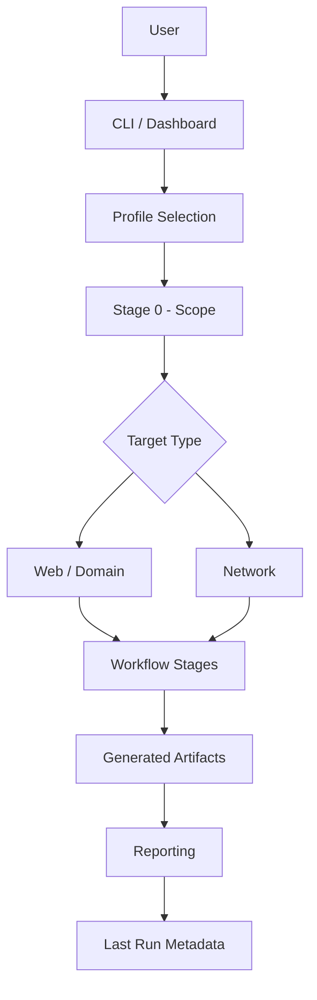
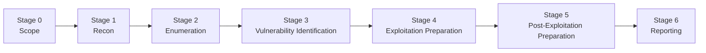

<div align="center">

# ScopeForgeX

### Stage-Based Cybersecurity Workflow Automation Framework

*A modular cybersecurity workflow orchestrator for reconnaissance, enumeration, vulnerability identification, analyst-assisted exploitation preparation, and automated assessment reporting.*


</div>

---

## Overview

- ScopeForgeX is a modular cybersecurity workflow orchestrator designed to organize reconnaissance, enumeration, vulnerability identification, analyst-assisted security testing, and reporting into a structured assessment workflow.

- Instead of treating security tools as isolated command-line utilities, ScopeForgeX executes supported integrations through a stage-based workflow. Each stage has a clearly defined responsibility, enabling assessments to remain organized, repeatable, and easier to extend.

- The framework focuses on workflow orchestration rather than replacing analyst decision-making. It automates repetitive discovery tasks, organizes generated artifacts, prepares higher-risk operations for analyst review, and produces structured Markdown reports summarizing completed workflow stages.

### Quick Highlights

- 🧩 Stage-based workflow architecture
- 🌐 Supports both web and network assessments
- ⚡ FAST and FULL_SAFE execution profiles
- 🛡️ Safety-first automation model
- 🔌 Modular tool registry
- 📂 Structured per-target output directories
- 📄 Automated Markdown reporting
- 🖥️ Interactive terminal dashboard
- 🧠 Shared workflow context between stages
- 📋 Persistent last-run metadata

---

## Design Philosophy

- ScopeForgeX is designed around several engineering principles:

    - **Modularity** — Every supported integration is implemented as an independent component.
    - **Safety** — Potentially intrusive operations remain under explicit analyst control.
    - **Reusability** — Workflow stages operate on shared context instead of isolated command execution wherever implemented.
    - **Extensibility** — New tools can be added without redesigning the workflow.
    - **Consistency** — Generated artifacts follow predictable directory structures for easier reporting and later analysis.

---

## Safety Model

- ScopeForgeX intentionally distinguishes between lower-risk discovery tasks and higher-risk offensive operations.

- Lower-risk reconnaissance, enumeration, and vulnerability-identification tasks may be executed automatically where implemented.

- Higher-risk activities—including exploitation, credential attacks, payload generation, tunneling, and post-exploitation actions—are represented as prepared commands requiring explicit analyst review before execution.

- This architecture helps preserve analyst control while still automating repetitive workflow management.

> **ScopeForgeX is intended only for authorized penetration testing, security research, CTFs, controlled laboratory environments, and systems for which you have explicit permission to assess.**

---

## Contents

- [Key Features](#key-features)
- [Architecture](#architecture)
- [Safety-First Execution Model](#safety-first-execution-model)
- [Supported Tool Integrations](#supported-tool-integrations)
- [Configured Tool Catalog](#configured-tool-catalog)
- [Dependencies](#dependencies)
- [Profiles](#profiles)
- [Repository Structure](#repository-structure)
- [Installation](#installation)
- [Usage](#usage)
- [Output Structure](#output-structure)
- [Reporting](#reporting)
- [Current Implementation Boundaries](#current-implementation-boundaries)
- [ScopeForgeX vs Subhunt](#scopeforgex-vs-subhunt)
- [Portfolio Engineering Focus](#portfolio-engineering-focus)
- [Legal and Ethical Use](#legal-and-ethical-use)
- [License](#license)

---

## Key Features

- ScopeForgeX is built around workflow orchestration rather than simply wrapping security tools behind a single command. The framework emphasizes modularity, repeatability, safety, and structured artifact generation throughout an assessment.

---

### Stage-Based Workflow

- Security assessments are divided into clearly defined stages, each responsible for a specific phase of the engagement.

| Stage | Purpose |
|--------|---------|
| Stage 0 | Scope collection and target classification |
| Stage 1 | Reconnaissance |
| Stage 2 | Enumeration |
| Stage 3 | Vulnerability Identification |
| Stage 4 | Exploitation Preparation |
| Stage 5 | Post-Exploitation Preparation |
| Stage 6 | Reporting |

- This architecture makes the workflow easier to extend, debug, and maintain than treating every tool as an isolated command.

---

### Multi-Target Support

- Stage 0 classifies input into supported target categories.

- Currently supported routing includes:
 
    - Web / Domain targets
    - Network / IP targets

- Target classification determines which workflow stages and registered tool integrations are applicable.

---

### Profile-Driven Execution

- ScopeForgeX currently provides two workflow profiles.

| Profile | Purpose |
|----------|----------|
| **FAST** | Connected reconnaissance pipeline for rapid discovery and vulnerability identification |
| **FULL_SAFE** | Complete safety-constrained workflow across implemented stages |

- Profiles enable users to select between faster reconnaissance and broader workflow execution without modifying the repository itself.

---

### Interactive Dashboard

- The terminal dashboard provides a simple interface for common operations.

- Current functionality includes:

    - Run FAST Profile
    - Run FULL_SAFE Profile
    - Install Supported Tools
    - View Last Run Metadata
    - Exit

- The dashboard removes the need to remember multiple CLI commands while exposing commonly used workflow operations.

---

### Connected Reconnaissance Pipeline

- Unlike many wrappers that simply execute one tool after another, ScopeForgeX allows downstream stages to consume artifacts produced by previous stages where integrations have been implemented.

- Current FAST workflow includes:

    - Subhunt discovery
    - Host normalization
    - Live host validation with httpx
    - Optional endpoint discovery using Katana
    - Host and URL normalization
    - Nuclei scanning
    - Markdown reporting

- This producer-to-consumer artifact flow is one of the project's primary architectural goals.

---

### Structured Output

- Every assessment creates an isolated output directory containing workflow artifacts such as:

    - Reconnaissance
    - Enumeration
    - Vulnerability results
    - Prepared commands
    - Logs
    - Reports

- Keeping artifacts separated by target simplifies later review and reporting.

---

### Analyst-Assisted Automation

- ScopeForgeX intentionally avoids automatically executing higher-risk actions.

- Instead, supported integrations can prepare commands for analyst review, allowing offensive operations to remain under explicit human control.

- Examples include:

    - SQLMap
    - Dalfox
    - XSStrike
    - Hydra
    - Chisel
    - Hashcat
    - John the Ripper 

- This design helps balance automation with operational safety.

---

### Markdown Reporting

- Stage 6 automatically generates a Markdown summary using workflow metadata and available artifacts.

- The generated report provides a structured overview of completed workflow stages without claiming manual validation that has not occurred.

---

### Persistent Workflow Metadata

- After a successful assessment, ScopeForgeX stores basic metadata describing the most recent execution.

- Currently stored information includes:

    - Target
    - Target Type
    - Output Directory

- This metadata is displayed through the dashboard's **View Last Run** feature.

---

## Architecture

- ScopeForgeX separates workflow orchestration from individual security tools.

- Instead of tightly coupling tools together, the framework coordinates independent integrations through shared workflow stages.



---

## Workflow Stages



- Each stage is responsible for a clearly defined portion of the assessment workflow.

- Actual execution depends on:

- Selected profile
- Target type
- Registered integrations
- Installed external tools
- Available workflow artifacts
- Safety restrictions implemented by individual stages

---

## Core Components

| Component | Responsibility |
|-----------|----------------|
| `scopeforgex.py` | Application entry point |
| `cli.py` | Command-line interaction |
| `dashboard.py` | Interactive terminal dashboard |
| `workflow.py` | Profile loading and stage orchestration |
| `runner.py` | External command execution |
| `state.py` | Last-run metadata persistence |
| `toolcheck.py` | Dependency validation |
| `installer.py` | Supported tool installation |
| `registry/` | Tool registration and grouping |
| `stages/` | Stage orchestration |
| `tools/` | Individual tool integrations |
| `reporting/` | Markdown report generation |

---

## Workflow Execution

- The overall execution model is intentionally deterministic.

```text
Launch ScopeForgeX

↓

Select Workflow Profile

↓

Collect Target

↓

Classify Target

↓

Create Shared Workflow Context

↓

Execute Enabled Stages

↓

Run Registered Tool Integrations

↓

Generate Artifacts

↓

Generate Report

↓

Persist Last Run Metadata
```

- Not every configured integration participates in every workflow.

- Execution depends on:

    - selected profile,
    - target type,
    - installed dependencies,
    - workflow routing,
    - and generated upstream artifacts.

- This distinction is important because ScopeForgeX should be understood as a **workflow orchestration framework**, not as a claim that every configured tool forms one completely automated penetration-testing pipeline.

---

## Supported Tool Integrations

- ScopeForgeX integrates multiple open-source security tools through a modular registry and stage-based execution model.

- It is important to distinguish between three different concepts used throughout the project:

| Category | Meaning |
|----------|----------|
| **Configured Tool** | Listed in `config/tools.yaml` |
| **Registered Integration** | Implemented inside the workflow registry |
| **Executed Tool** | Actually executed during the selected workflow |

- These three categories are intentionally independent.

- A configured tool is **not automatically registered**, and a registered integration is **not automatically executed** for every workflow profile.

---

## Stage 1 — Reconnaissance

- The reconnaissance stage focuses on discovering targets and collecting information that can be consumed by downstream workflow stages.

### Web Reconnaissance

| Tool | Purpose |
|------|----------|
| **Subhunt** | Subdomain discovery |
| **httpx** | Live host validation |
| **Katana** *(Optional)* | Endpoint discovery |

- The FAST workflow builds a connected reconnaissance pipeline using these tools.

---

### Network Reconnaissance

| Tool | Purpose |
|------|----------|
| **Naabu** | Fast TCP port discovery |
| **RustScan** | High-speed port scanning |
| **Nmap** | Detailed network scanning |

---

## Stage 2 — Enumeration

- Enumeration is routed according to the classified target type.

### Web Enumeration

| Tool | Purpose |
|------|----------|
| WhatWeb | Technology fingerprinting |
| wafw00f | WAF detection |
| ffuf | Directory and content discovery |

---

### Network Enumeration

| Tool | Purpose |
|------|----------|
| enum4linux-ng | SMB enumeration |
| snmpwalk | SNMP enumeration |

- Target-aware routing prevents web and network enumeration tools from being treated as interchangeable.

---

## Stage 3 — Vulnerability Identification

| Tool | Purpose |
|------|----------|
| Nuclei | Template-based vulnerability identification |

- When supported artifacts exist, Nuclei consumes normalized host and URL targets generated by earlier stages.

- Separate scans are performed for:

    - Hosts
    - URLs

- This separation allows different artifact types to be processed independently.

---

## Stage 4 — Exploitation Preparation

- Rather than automatically executing offensive actions, ScopeForgeX prepares analyst-review commands for supported validation tools.

- Current integrations include:

| Tool | Purpose |
|------|----------|
| SQLMap | SQL Injection validation |
| Dalfox | XSS validation |
| XSStrike | XSS testing |
| SSTImap | SSTI testing |
| SearchSploit | Exploit lookup |
| msfvenom | Payload generation |
| Netcat | Listener and shell preparation |

- These integrations assist analysts without automatically launching potentially intrusive actions.

---

## Stage 5 — Post-Exploitation Preparation

- Current prepared-command integrations include:

| Tool | Purpose |
|------|----------|
| Chisel | Pivoting / Tunneling |
| SSH | Remote shell preparation |
| Hydra | Credential attacks |
| Medusa | Credential attacks |
| Hashcat | Password cracking |
| John the Ripper | Password cracking |

- These commands require explicit analyst review before execution.

---

## Workflow Philosophy

- The objective of ScopeForgeX is **workflow orchestration**, not simply wrapping dozens of security tools behind a single command.

- Each integration contributes to one of three responsibilities:

    - Produce workflow artifacts
    - Consume existing workflow artifacts
    - Prepare analyst-controlled actions

- This separation keeps the framework modular and easier to extend.

---

## Configured Tool Catalog

- The repository contains a broader catalog of tools than the subset currently connected to active workflow execution.

- Configured tools are defined in:

    ```text
    config/tools.yaml
    ```

- Current catalog includes:

    ```text
    chisel
    dalfox
    dig
    dnsenum
    dnsrecon
    enum4linux-ng
    feroxbuster
    ffuf
    gau
    gobuster
    hashcat
    httpx
    hydra
    john
    katana
    knockpy
    lbd
    medusa
    msfvenom
    naabu
    nbtstat
    netcat
    nikto
    nmap
    nuclei
    onesixtyone
    rustscan
    searchsploit
    smbclient
    smbmap
    snmpcheck
    snmpwalk
    sqlmap
    ssh
    sstimap
    subhunt
    sublist3r
    wafw00f
    whatweb
    wpscan
    xsstrike
    ```

---

## Important Distinction

- Some configured tools are fully integrated into workflow execution.

- Others are currently:

    - configuration entries,
    - installer targets,
    - or future workflow candidates.

- This documentation intentionally reflects the current implementation rather than implying that every configured tool participates in automated execution.

---

## Dependencies

- ScopeForgeX combines Python packages with external security CLI tools.

---

## Python Dependencies

- Install project requirements using:

    ```bash
    pip install -r requirements.txt
    ```

- A virtual environment is recommended.

```bash
python3 -m venv .venv

source .venv/bin/activate

pip install -r requirements.txt
```

- The repository's `requirements.txt` remains the authoritative dependency source.

---

## External CLI Tools

- Depending on the selected workflow profile, ScopeForgeX may use:

| Tool Category | Examples |
|---------------|----------|
| Reconnaissance | Subhunt, httpx, Katana |
| Network Discovery | Naabu, RustScan, Nmap |
| Enumeration | WhatWeb, wafw00f, ffuf, enum4linux-ng |
| Vulnerability Identification | Nuclei |

- Some workflow paths only execute when the corresponding dependency is available.

- For example:

    - Katana is optional within the FAST pipeline.
    - Web and network assessments load different integrations.
    - Missing tools may cause individual stages to skip execution rather than terminate the entire workflow.

---

## Prepared Command Dependencies

- Prepared-command integrations reference tools such as:

    - SQLMap
    - Dalfox
    - XSStrike
    - SSTImap
    - SearchSploit
    - msfvenom
    - Chisel
    - Hydra
    - Hashcat
    - John the Ripper

- These tools are only required if the analyst intends to execute the prepared commands.

---

## Installer

- ScopeForgeX includes a built-in installer for a subset of supported tools.

- Run:

    ```bash
    python3 scopeforgex.py --install-tools
    ```

- The installer is intended to simplify environment setup but should not be interpreted as a complete package manager for every configured integration.

- Always verify required dependencies before running a workflow profile.

---

## Profiles

- Workflow behavior is controlled through profile definitions stored in:

    ```text
    config/profiles.yaml
    ```

- Each profile enables a different subset of workflow stages.

---

## FAST Profile

- The FAST profile focuses on rapid reconnaissance and vulnerability identification.

- Enabled stages:

| Stage | Description |
|--------|-------------|
| Stage 0 | Scope Collection |
| Stage 1 | Reconnaissance |
| Stage 3 | Vulnerability Identification |
| Stage 6 | Reporting |

- Current connected workflow:

    ```text
    Target
    │
    ▼
    Subhunt
    │
    ▼
    Host Normalization
    │
    ▼
    httpx
    │
    ▼
    Validated Hosts
    ├───────────────┐
    ▼               ▼
    Katana          Nuclei
    (Optional)      Host Scan
    │
    ▼
    URL Normalization
    │
    ▼
    Nuclei URL Scan
    │
    ▼
    Markdown Report
    ```

- FAST prioritizes speed while preserving structured artifact generation.

---

## FULL_SAFE Profile

- FULL_SAFE enables the broader stage sequence.

- Enabled stages:

| Stage | Description |
|--------|-------------|
| Stage 0 | Scope |
| Stage 1 | Reconnaissance |
| Stage 2 | Enumeration |
| Stage 3 | Vulnerability Identification |
| Stage 4 | Exploitation Preparation |
| Stage 5 | Post-Exploitation Preparation |
| Stage 6 | Reporting |

- Unlike FAST, FULL_SAFE executes the complete safety-constrained workflow.

- Higher-risk actions remain subject to analyst approval and are represented as prepared commands rather than automatically executed offensive operations.

---

## Choosing a Profile

| Use Case | Recommended Profile |
|----------|---------------------|
| Rapid reconnaissance | FAST |
| Complete assessment workflow | FULL_SAFE |
| Initial bug bounty recon | FAST |
| Full internal assessment | FULL_SAFE |

- Selecting a profile determines:

    - Which workflow stages execute.
    - Which registered integrations become available.
    - Which artifacts are produced.
    - Which prepared commands may be generated.

- The profile system allows ScopeForgeX to support multiple assessment workflows while keeping the orchestration logic modular and easy to maintain.

---

## Repository Structure

- ScopeForgeX follows a modular architecture that separates configuration, workflow orchestration, tool integrations, reporting, and generated assessment artifacts.

    ```text
    ScopeForgeX/
    │
    ├── config/                  # Workflow configuration
    ├── reporting/               # Reporting implementation
    ├── scopeforgex/             # Core framework
    │   ├── registry/            # Tool registration
    │   ├── stages/              # Workflow stages
    │   ├── tools/               # Tool integrations
    │   └── ...
    │
    ├── outputs/                 # Generated assessment artifacts
    │
    ├── requirements.txt
    ├── scopeforgex.py
    └── README.md
    ```

- The repository intentionally separates orchestration logic from tool-specific implementations, making it easier to extend the framework without modifying the core workflow engine.

---

## Repository Layout

| Directory | Purpose |
|------------|---------|
| `config/` | Workflow profiles, default configuration and tool catalog |
| `scopeforgex/` | Core application package |
| `scopeforgex/stages/` | Stage orchestration |
| `scopeforgex/tools/` | Individual tool integrations |
| `scopeforgex/registry/` | Registry and grouping system |
| `reporting/` | Markdown report generation |
| `outputs/` | Runtime-generated assessment artifacts |

---

## Core Components

| Component | Responsibility |
|-----------|----------------|
| `scopeforgex.py` | Main application entry point |
| `workflow.py` | Profile execution and stage orchestration |
| `dashboard.py` | Interactive dashboard |
| `cli.py` | Command-line interface |
| `runner.py` | External command execution |
| `state.py` | Last-run metadata persistence |
| `toolcheck.py` | Dependency validation |
| `installer.py` | Supported dependency installation |
| `wordlists.py` | Wordlist management |
| `merger.py` | Utility functions for artifact merging |

---

## Stage Organization

- Each workflow stage is implemented independently.

```text
Stage 0
Scope Collection

↓

Stage 1
Reconnaissance

↓

Stage 2
Enumeration

↓

Stage 3
Vulnerability Identification

↓

Stage 4
Exploitation Preparation

↓

Stage 5
Post-Exploitation Preparation

↓

Stage 6
Reporting
```

- This modular structure allows individual stages to evolve independently while sharing a common workflow context.

---

## Installation

### Requirements

- Before installing ScopeForgeX, ensure your environment provides:

    - Python 3.10+
    - Git
    - Linux environment
    - Internet connectivity for installing external tools

- Several workflow integrations also require third-party security tools that are **not Python packages**.

---

### Clone the Repository

```bash
git clone https://github.com/VikashChoudhary-04/ScopeForgeX.git

cd ScopeForgeX
```

- HTTPS cloning may also be used if preferred.

---

### Create a Virtual Environment

- Although optional, using a virtual environment is recommended.

```bash
python3 -m venv .venv

source .venv/bin/activate
```

---

### Install Python Dependencies

```bash
pip install -r requirements.txt
```

- The repository's `requirements.txt` is the authoritative source for Python dependencies.

---

### Install Supported External Tools

- ScopeForgeX provides an installer for a subset of supported tools.

```bash
python3 scopeforgex.py --install-tools
```

- The installer simplifies setup but does **not** install every tool listed in `config/tools.yaml`.

- Always verify that the tools required by your chosen workflow profile are available.

---

### Verify Installation

- Launch the application.

```bash
python3 scopeforgex.py
```

- A successful installation should display the interactive dashboard.

```text
ScopeForgeX Dashboard

1. FAST Profile

2. FULL_SAFE Profile

3. Install Tools

4. View Last Run

5. Exit
```

---

## Usage

- Launching ScopeForgeX opens the interactive dashboard.

```bash
python3 scopeforgex.py
```

- From here you can:

    - Run FAST Profile
    - Run FULL_SAFE Profile
    - Install Tools
    - View Last Run
    - Exit

---

## Running the FAST Profile

- FAST focuses on rapid reconnaissance.

- Typical execution flow:

    ```text
    Collect Target

    ↓

    Subhunt

    ↓

    Host Validation

    ↓

    Optional Endpoint Discovery

    ↓

    Nuclei

    ↓

    Report Generation
    ```

- FAST is recommended for:

    - Bug bounty reconnaissance
    - Asset discovery
    - Initial attack-surface mapping
    - Quick vulnerability identification

---

## Running the FULL_SAFE Profile

- FULL_SAFE executes every implemented workflow stage.

- Typical execution sequence:

    ```text
    Scope

    ↓

    Reconnaissance

    ↓

    Enumeration

    ↓

    Vulnerability Identification

    ↓

    Prepared Exploitation Commands

    ↓

    Prepared Post-Exploitation Commands

    ↓

    Reporting
    ```

- This profile is intended for broader security assessments while maintaining the framework's safety-first philosophy.

---

## View Last Run

- ScopeForgeX stores metadata describing the most recently completed workflow.

- Current metadata includes:

    - Target
    - Target Type
    - Output Directory
 
- This information can be reviewed directly from the dashboard.

> **Note**
>
> View Last Run is **not** a workflow resume feature.
> It displays metadata only and does not restore partially completed assessments.

---

## Workflow Example

- Example assessment:

    ```text
    python3 scopeforgex.py

    ↓

    Select FAST

    ↓

    Target:
    example.com

    ↓

    Reconnaissance

    ↓

    Host Validation

    ↓

    Nuclei

    ↓

    report.md generated
    ```

- The exact execution path depends on:

    - selected profile,
    - installed dependencies,
    - target type,
    - available workflow artifacts.

---

## Output Structure

- Every assessment creates a dedicated output directory.

- Typical layout:

    ```text
    outputs/

    └── example.com/

    ├── recon/

    ├── enum/

    ├── vuln/

    ├── exploit/

    ├── post/

    ├── logs/

    └── report.md
  ```

- Organizing artifacts by target keeps assessments isolated and simplifies later review.

---

## Reconnaissance Artifacts

- Depending on the selected workflow and installed tools, the reconnaissance stage may generate files such as:

    ```text
    subhunt.txt

    hosts_raw.txt

    hosts_alive.txt

    hosts_final.txt

    katana.txt

    urls_raw.txt

    urls_final.txt
    ```

- Some artifacts are conditional.

- For example, Katana output is only produced when Katana is installed and executed.

---

## Vulnerability Artifacts

- Stage 3 generates vulnerability-identification artifacts.

- Typical examples include:

    ```text
    nuclei_hosts.txt

    nuclei_urls.txt

    nuclei_hosts.log

    nuclei_urls.log
    ```

- Host and URL scans are intentionally separated.

---

## Prepared Commands

- Stages 4 and 5 may generate prepared commands for analyst review.

- These outputs should be interpreted as:

    - suggested follow-on actions,
    - not evidence of exploitation,
    - and not proof of successful compromise.

---

## Generated Reports

- Stage 6 automatically produces:

    ```text
    report.md
    ```

- The report summarizes:

    - workflow metadata,
    - executed stages,
    - available artifacts,
    - vulnerability-identification results.

- The generated report is designed as a structured workflow summary and should not be interpreted as a complete professional penetration-testing report without analyst review.

---

## Last-Run Metadata

- Basic workflow metadata is stored separately from assessment artifacts.

```text
outputs/.last_run.json
```

- This file enables the dashboard's **View Last Run** feature and should not be confused with a workflow checkpoint or resume mechanism.

---

## Reporting

- Stage 6 generates a structured Markdown report summarizing the completed assessment workflow.

- The report consolidates workflow metadata together with available artifacts produced during earlier stages.

- Current report contents may include:

    - Target
    - Target Type
    - Selected Workflow Profile
    - Output Directory
    - Executed Workflow Stages
    - Available Reconnaissance Artifacts
    - Available Enumeration Results
    - Available Vulnerability Identification Results

- Where available, Stage 6 consumes the Nuclei logging contract produced during Stage 3.

- Current supported inputs include:

    ```text
    vuln/nuclei_hosts.log
    vuln/nuclei_urls.log
    ```

---

## Purpose

- The generated report is intended to provide a structured summary of the automated workflow.

- It should **not** be interpreted as a complete professional penetration-testing report containing:

    - Manual validation
    - Business impact analysis
    - CVSS scoring
    - Executive summaries
    - Evidence screenshots
    - Risk prioritization
    - Remediation verification

- Those activities remain the responsibility of the security analyst.

---

## Reporting Package

- Reporting logic is implemented through the repository's top-level:

    ```text
    reporting/
    ```

directory.

- Documentation intentionally avoids referencing packages that do not exist within the repository.

---

## Current Implementation Boundaries

- ScopeForgeX deliberately documents its implementation boundaries so that repository documentation remains aligned with the actual codebase.

- The goal is to describe current capabilities accurately without overstating automation.

---

## Last-Run Metadata Is Not Workflow Resume

- The dashboard's **View Last Run** feature displays metadata describing the most recent completed workflow.

- Currently stored information includes:

    - Target
    - Target Type
    - Output Directory

- It does **not** restore:

    - interrupted workflows,
    - stage checkpoints,
    - execution context,
    - partial artifacts,
    - or workflow state.

---

## Configured Tools Are Not Always Registered

- A tool appearing in:

    ```text
    config/tools.yaml
    ```

- does not automatically imply:

    - workflow integration,
    - stage registration,
    - or execution within every profile.

- Documentation intentionally distinguishes between configuration and implementation.

---

## Installer Coverage Is Partial

- The built-in installer simplifies environment setup but does not install every configured tool.

- Users should verify required dependencies before running a workflow.

---

## Pipeline Connectivity Varies

- The FAST workflow contains the project's most complete producer-to-consumer artifact flow.

- Other workflow stages may execute independently without the same level of downstream artifact integration.

- This reflects the current implementation rather than a design limitation.

---

## Prepared Commands Are Not Executed Automatically

- Stages 4 and 5 prepare analyst-review commands.

- Prepared commands do **not** imply:

    - successful exploitation,
    - shell access,
    - privilege escalation,
    - credential compromise,
    - persistence,
    - or lateral movement.

- Those actions remain under explicit analyst control.

---

## Reporting Reflects Available Artifacts

- Generated reports summarize workflow outputs that actually exist.

- They do not infer findings or generate evidence that has not been produced during the assessment.

---

## ScopeForgeX vs Subhunt

- Although closely related, ScopeForgeX and Subhunt solve different problems.

---

### Subhunt

- Subhunt is a dedicated subdomain discovery utility.

- Within ScopeForgeX it serves as one reconnaissance integration capable of producing normalized discovery artifacts for downstream workflow stages.

- Typical FAST pipeline:

    ```text
    Subhunt

    ↓

    Host Normalization

    ↓

    httpx

    ↓

    Optional Katana

    ↓

    Nuclei
    ```

---

### ScopeForgeX

- ScopeForgeX is the orchestration layer responsible for coordinating multiple assessment stages.

- Current responsibilities include:

    - Workflow orchestration
    - Target classification
    - Stage management
    - Tool registration
    - Profile execution
    - Artifact organization
    - Connected FAST workflow
    - Prepared-command generation
    - Markdown reporting
    - Last-run metadata persistence

- Subhunt is therefore one component within the larger ScopeForgeX ecosystem rather than a replacement for it.

---

## Portfolio Engineering Focus

- ScopeForgeX demonstrates software engineering concepts that extend beyond simply executing security tools.

- Current architectural concepts include:

    - Stage-based workflow orchestration
    - Modular tool registry
    - Profile-driven execution
    - Shared workflow context
    - Target-aware routing
    - Producer-to-consumer artifact flow
    - Normalized intermediate artifacts
    - Structured output organization
    - Analyst-assisted automation
    - Dependency validation
    - Modular reporting
    - Persistent workflow metadata

- A deliberate design goal of the project is to document implementation status honestly rather than presenting planned functionality as completed features.

- This helps ensure portfolio claims remain technically defensible.

---

## Roadmap

- Future improvements planned for ScopeForgeX include:

    - Additional workflow integrations
    - Expanded artifact chaining
    - Resume-capable workflow checkpoints
    - Enhanced reporting templates
    - Plugin architecture for third-party integrations
    - Parallel task execution where appropriate
    - Improved dashboard analytics
    - Export formats beyond Markdown
    - Additional workflow profiles
    - Extended installer coverage

- These items represent planned enhancements and should not be interpreted as currently implemented functionality.

---

## Contributing

- Contributions that improve code quality, workflow reliability, documentation, testing, or usability are welcome.

- When contributing:

    1. Fork the repository.
    2. Create a feature branch.
    3. Implement and test your changes.
    4. Update documentation where appropriate.
    5. Submit a Pull Request describing the proposed improvement.

- Large architectural changes should be discussed before implementation to ensure they align with the project's design philosophy.

---

## Legal and Ethical Use

- ScopeForgeX is intended exclusively for:

    - Authorized penetration testing
    - Internal security assessments
    - Red-team exercises conducted with explicit permission
    - Controlled laboratory environments
    - Capture The Flag (CTF) competitions
    - Security research performed within approved scope

- Do **not** use ScopeForgeX against systems, applications, networks, or infrastructure without explicit authorization.

- Users are responsible for:

    - obtaining written permission where required,
    - respecting assessment scope,
    - understanding the behavior of external tools,
    - reviewing prepared commands before execution,
    - protecting collected assessment data, 
    - complying with applicable laws and organizational policies.

- The framework's safety-oriented architecture does not replace professional judgment or legal authorization.

---

## License

- This project is released under the license included in this repository.

- Please refer to the repository's `LICENSE` file for the complete licensing terms governing use, modification, and distribution.

---

<div align="center">

**ScopeForgeX**

*A Modular, Stage-Based Cybersecurity Workflow Automation Framework*

Designed for authorized security assessments, offensive security training, and workflow-driven penetration testing.

⭐ If you find this project useful, consider starring the repository.

</div>
